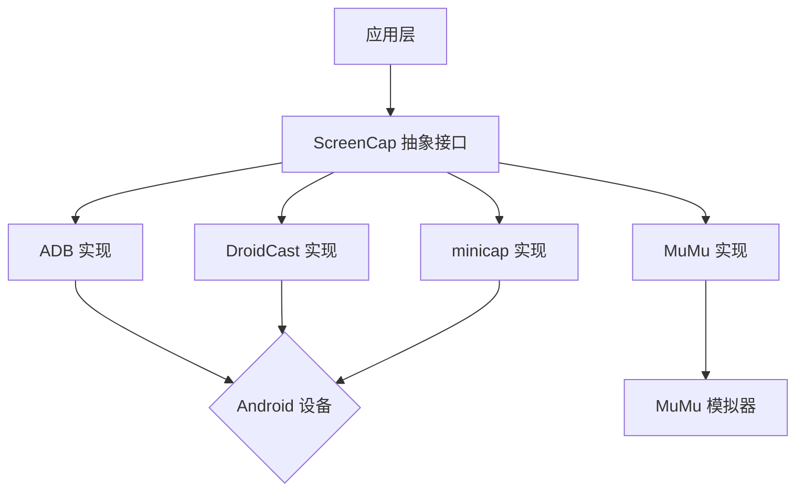

# MSC (Multi-Screencap Control) 框架

## 🌟 特性

- 统一的截图控制抽象接口（`ScreenCap`）
- 多种底层实现可选：
  - ADB 原生指令
  - [DroidCast](https://github.com/rayworks/DroidCast) 分支自改版本
  - [minicap](https://github.com/openstf/minicap) 实时屏幕数据
  - [MuMu](https://mumu.163.com/) 模拟器专属支持

## 📦 安装

```bash
# 全量安装（包含 ADB / DroidCast / minicap / MuMu）
uv add "git+https://github.com/NakanoSanku/msc"

# 选择性安装
# 仅安装 minicap 方案
uv add "git+https://github.com/NakanoSanku/msc#subdirectory=msc-minicap"
```

## 🛠️ 实现方案对比

| 特性                     | ADB             | DroidCast       | minicap                   | MuMu           |
| ------------------------ | --------------- | --------------- | ------------------------- | -------------- |
| 延迟（单帧感知）         | 中              | 中              | 最低                      | 最低           |
| 需要 root                | 否              | 否              | 否                        | 否             |
| 完整截图数据支持         | 是              | 是              | 是（RGBA 全量帧）         | 是             |
| 设备兼容性               | 通用            | 通用            | 通用（不保证 Android 13+） | MuMu12 专属    |
| 参考性能\*（本机 1920×1080） | ~560 ms / 帧    | ~380 ms / 帧    | ~1.3 ms / 帧              | 未在本机评测   |

\* 性能数据为当前开发环境下的参考值，不同设备和分辨率会有差异。

## 🚀 快速开始

安装完成后，可以直接通过统一的 `ScreenCap` 接口使用不同实现：

```python
from msc.screencap import ScreenCap
from msc.adbcap import ADBCap
from msc.droidcast import DroidCast
from msc.minicap import MiniCap
from msc.mumu import MuMuCap


def perform_screencap(controller: ScreenCap) -> None:
    # 截图为 OpenCV Mat（BGR）格式
    mat = controller.screencap()

    # 保存截图到文件
    controller.save_screencap("screencap.png")

    # 获取原始截图字节数据（RGBA / 实现相关）
    raw = controller.screencap_raw()
    print("mat shape:", mat.shape, "raw bytes:", len(raw))


perform_screencap(ADBCap("emulator-5554"))
perform_screencap(DroidCast("127.0.0.1:7555"))
# perform_screencap(MiniCap("emulator-5554"))
perform_screencap(MuMuCap(0))
```

## 📚 模块架构



## 📄 核心模块

### msc-base

基础抽象层，定义了 `ScreenCap` 抽象基类。

### msc-adb

使用 ADB 命令实现的截图控制。

### msc-droidcast

使用 DroidCast 方案实现通用截图控制（HTTP 原始帧）。

### msc-minicap

使用 minicap 方案实现低延迟、全分辨率截图控制（RGBA 流式数据）。

### msc-mumu

针对 MuMu 模拟器的截图控制实现。

## 📝 TODO

- [ ] 改进 minicap 源码，进一步优化编码链路
- [ ] 支持雷电等其他模拟器专属方案

## 🤝 贡献指南

欢迎通过 Issue / PR 参与改进，请参考 `CONTRIBUTING.md`。

